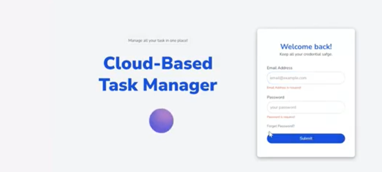
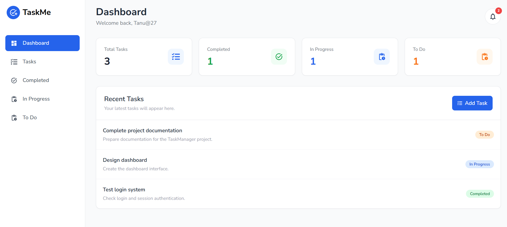
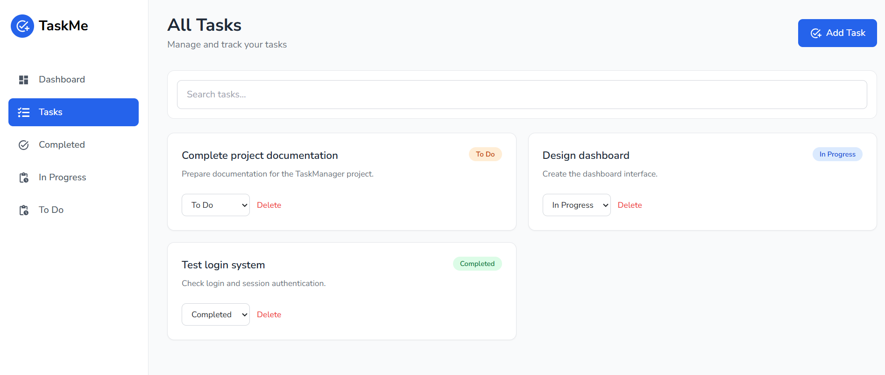
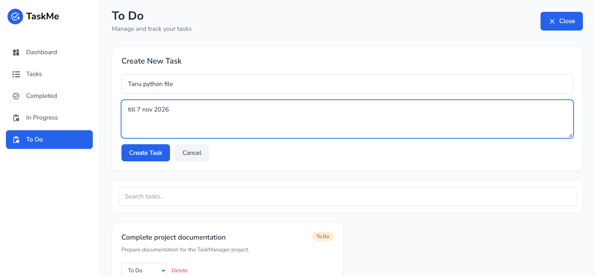
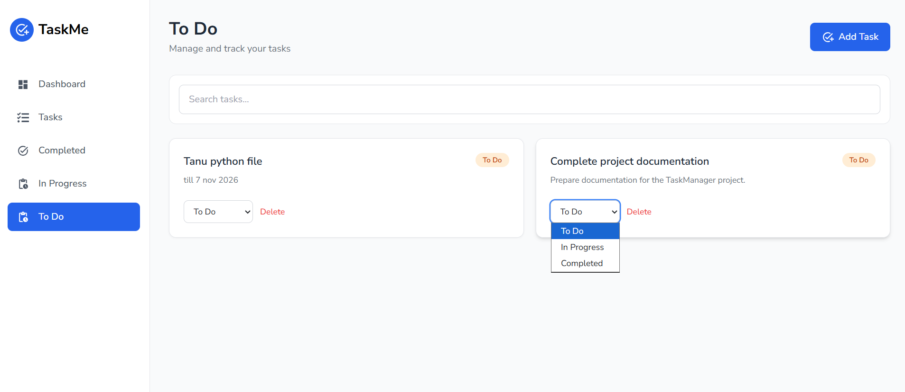

# TaskMe - Task Management Web App

TaskMe is a task management web application built to help users create, organize, track, and manage their tasks through a clean and simple interface.

The project was developed as a hands-on project to strengthen frontend development, React, state management, routing, and Git/GitHub skills.

---

##  Features

-User Login
-Dashboard
-Create and manage tasks
-Search tasks
-Filter tasks by status
-Completed tasks
-In Progress tasks
-To Do tasks
-Team/User management
-Trash management
-Notifications
-User profile menu
-Responsive interface
-Task data persistence using Local Storage
## 🚀 Features

- 🔐 User Login
- 📊 Dashboard
- ➕ Create and manage tasks
- 🔎 Search tasks
- 📌 Filter tasks by status
- ✅ Completed tasks
- 🔄 In Progress tasks
- 📝 To Do tasks
- 👥 Team/User management
- 🗑️ Trash management
- 🔔 Notifications
- 👤 User profile menu
- 📱 Responsive interface
- 💾 Task data persistence using Local Storage

---

##  Tech Stack

### Frontend

- React.js
- Vite
- JavaScript
- HTML5
- CSS3
- Tailwind CSS

### Libraries

- React Router
- Redux / React Redux
- React Icons
- React Hook Form

### Development Tools

- Git
- GitHub
- VS Code
- npm

---
## 📸 Project Screenshots

### 🔐 Login Page

<p align="center">
  
</p>

### 📊 Dashboard

<p align="center">
  
</p>

### 📝 Task Management

<p align="center">
  
</p>

### ➕ Add Task

<p align="center">
  
</p>

### 📝 To Do

<p align="center">
  
</p>
## 📂 Project Structure

```text
TASKMANAGER/
│
├── client/
│   │
│   ├── src/
│   │   ├── assets/
│   │   │
│   │   ├── components/
│   │   │   ├── Navbar.jsx
│   │   │   ├── Sidebar.jsx
│   │   │   ├── Button.jsx
│   │   │   ├── Textbox.jsx
│   │   │   └── ...
│   │   │
│   │   ├── pages/
│   │   │   ├── Login.jsx
│   │   │   ├── Dashboard.jsx
│   │   │   ├── Tasks.jsx
│   │   │   ├── Users.jsx
│   │   │   ├── Trash.jsx
│   │   │   └── TaskDetails.jsx
│   │   │
│   │   ├── App.jsx
│   │   ├── main.jsx
│   │   └── index.css
│   │
│   ├── package.json
│   └── ...
│
└── README.md
└── README.md
